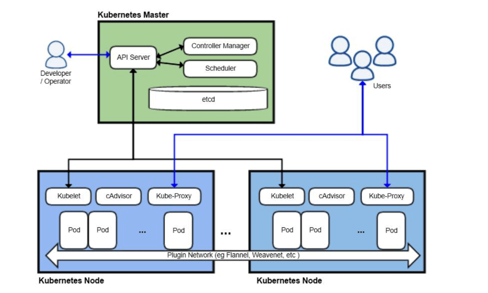

# Kubernetes (K8s) 

Kubernetes (a.k.a. **K8s**) is the world’s leading **container orchestration platform**, originally built by Google and now maintained by the **Cloud Native Computing Foundation (CNCF)**. It helps teams deploy, scale, and manage containerized applications in a **reliable, automated, and cloud-agnostic** way.  

---

##  Table of Contents
1. [What is Kubernetes?](#-what-is-kubernetes)  
2. [Key Features](#-key-features)  
3. [Kubernetes Architecture](#-kubernetes-architecture)  
   - [Control Plane](#control-plane)  
   - [Worker Nodes](#worker-nodes)  
   - [Kubernetes Objects](#kubernetes-objects)  
4. [Kubernetes Workflow](#-kubernetes-workflow)  
5. [Competitors & Comparisons](#-competitors--alternatives-to-kubernetes)  
6. [Advantages & Challenges](#-advantages--challenges)  
7. [Use Cases](#-use-cases)  
8. [Resources](#-resources)  
9. [Examples](#-examples)  

---

##  What is Kubernetes?

Kubernetes is an **open-source system for automating deployment, scaling, and management of containerized applications**.  

It provides:
- Service discovery & load balancing  
- Automated rollouts & rollbacks  
- Storage orchestration  
- Secret & configuration management  
- Self-healing (auto-restarts, rescheduling)  
- Horizontal scaling (autoscaling pods based on load)  

---

##  Key Features

- **Declarative model** → Define the *desired state*, K8s ensures it happens.  
- **Self-healing** → Failed containers are restarted automatically.  
- **Scalability** → Scale up or down instantly.  
- **Portability** → Works across cloud providers and on-prem.  
- **Ecosystem** → Integrates with Helm, Istio, Prometheus, etc.  

---

##  Kubernetes Architecture

Kubernetes uses a **master–worker (control plane + nodes)** design.

```
                 ┌─────────────────────────┐
                 │     Control Plane        │
                 │ (Cluster Management)     │
                 ├─────────────────────────┤
                 │ API Server               │
                 │ etcd (Cluster Store)     │
                 │ Scheduler                │
                 │ Controller Manager       │
                 └─────────────────────────┘
                           │
            ───────────────┼────────────────────
                           │
       ┌───────────────────┴───────────────────┐
       │                                       │
┌───────────────┐                      ┌───────────────┐
│   Worker Node │                      │   Worker Node │
├───────────────┤                      ├───────────────┤
│ kubelet       │                      │ kubelet       │
│ kube-proxy    │                      │ kube-proxy    │
│ Container R/T │                      │ Container R/T │
│   (Docker)    │                      │   (containerd)│
├───────────────┤                      ├───────────────┤
│     Pods      │                      │     Pods      │
│  (Containers) │                      │  (Containers) │
└───────────────┘                      └───────────────┘
```

---



---

###  Control Plane
The **brain** of Kubernetes.
- **API Server (`kube-apiserver`)** → Entry point for all commands.  
- **etcd** → Distributed key-value store for configs and cluster state.  
- **Scheduler** → Assigns Pods to Nodes.  
- **Controller Manager** → Ensures desired state (e.g., reschedules failed Pods).  

### 🔹 Worker Nodes
Nodes run applications inside **Pods**.
- **Kubelet** → Agent that runs on each node.  
- **Kube-proxy** → Handles networking and load balancing.  
- **Container Runtime** → (Docker, containerd, CRI-O) runs containers.  

### 🔹 Kubernetes Objects
- **Pod** → Smallest deployable unit (1+ containers).  
- **Service** → Provides stable networking to Pods.  
- **Deployment** → Declarative scaling and rolling updates.  
- **ConfigMap/Secret** → Configuration & sensitive data.  
- **Namespace** → Logical separation of resources.  

---

##  Kubernetes Workflow

1. You submit a config (`kubectl apply -f deployment.yaml`)  
2. **API Server** validates request  
3. **etcd** stores desired state  
4. **Scheduler** assigns Pods to nodes  
5. **Kubelet** on node runs containers  
6. **Controller Manager** ensures state matches config  
7. **Kube-proxy** handles networking  

---

##  Competitors & Alternatives to Kubernetes

###  Docker Swarm
- Simple, Docker-native.  
- Easy to set up, limited scaling.  
- Good for **small teams**.  

###  HashiCorp Nomad
- Lightweight, supports containers & legacy apps.  
- Easier learning curve.  
- Fewer built-in features than Kubernetes.  

###  Apache Mesos + Marathon
- Older, supports big data + non-container workloads.  
- Complex, losing popularity.  

###  Cloud Provider Services
- **AWS ECS** → Simple, AWS-only.  
- **AWS EKS** → Managed Kubernetes.  
- **GCP GKE** → Google’s managed Kubernetes.  
- **Azure AKS** → Microsoft’s managed Kubernetes.  

---

##  Advantages &  Challenges

**Advantages:**
- Scales apps reliably  
- Self-healing  
- Multi-cloud, hybrid-friendly  
- Huge ecosystem + community  

**Challenges:**
- Steep learning curve  
- Operational complexity  
- Overkill for small/simple projects  

---

##  Use Cases

- Microservices applications  
- Hybrid cloud deployments  
- Machine learning pipelines  
- CI/CD automation  
- High availability enterprise apps  

---

##  Examples

### Deployment Example (`deployment.yaml`)
```yaml
apiVersion: apps/v1
kind: Deployment
metadata:
  name: nginx-deployment
  labels:
    app: nginx
spec:
  replicas: 3
  selector:
    matchLabels:
      app: nginx
  template:
    metadata:
      labels:
        app: nginx
    spec:
      containers:
      - name: nginx
        image: nginx:1.21
        ports:
        - containerPort: 80
```

### Service Example (`service.yaml`)
```yaml
apiVersion: v1
kind: Service
metadata:
  name: nginx-service
spec:
  selector:
    app: nginx
  ports:
    - protocol: TCP
      port: 80
      targetPort: 80
  type: LoadBalancer
```

---

 Kubernetes has become the **de facto standard** for container orchestration, replacing Docker Swarm, Mesos, and Nomad in most large-scale production environments.  
