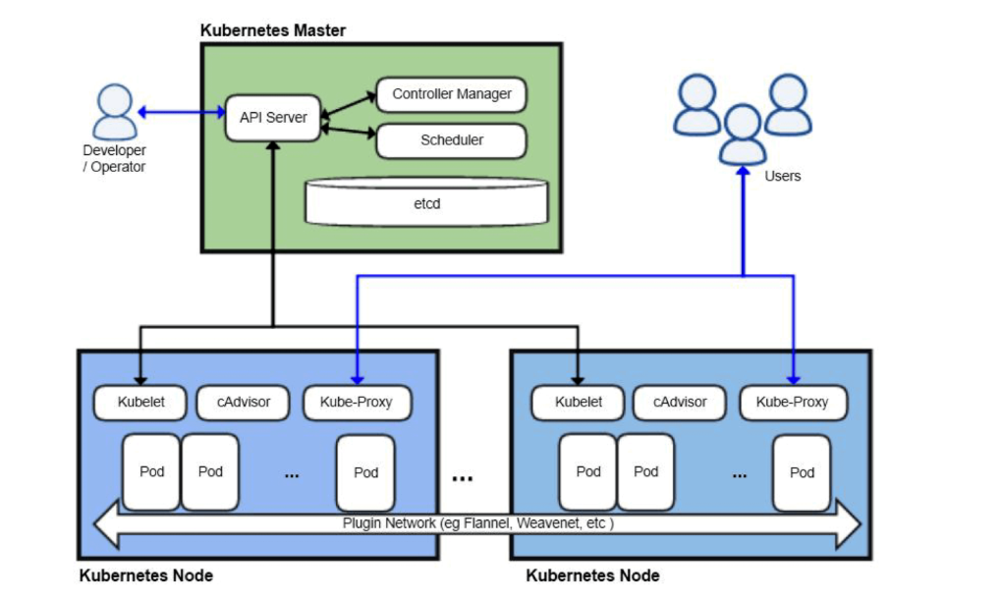

# Kubernetes (K8s) 

Kubernetes (a.k.a. **K8s**) is the world’s leading **container orchestration platform**, originally built by Google and now maintained by the **Cloud Native Computing Foundation (CNCF)**. It helps teams deploy, scale, and manage containerized applications in a **reliable, automated, and cloud-agnostic** way.  

---

## Table of Contents

1. [What is Kubernetes?](#what-is-kubernetes)  
2. [Key Features](#key-features)  
3. [Kubernetes Architecture](#kubernetes-architecture)  
   - [Control Plane](#control-plane)  
   - [Worker Nodes](#worker-nodes)  
   - [Kubernetes Objects](#kubernetes-objects)  
4. [Kubernetes Workflow](#kubernetes-workflow)  
5. [Competitors & Alternatives to Kubernetes](#competitors--alternatives-to-kubernetes)  
6. [Advantages & Challenges](#advantages--challenges)  
7. [Use Cases](#use-cases)  
8. [Resources](#resources)  
9. [Examples](#examples)  
10. [Workload Management](#workload-management)  
11. [Security in Kubernetes](#security-in-kubernetes)  
12. [Observability](#observability)  
13. [Networking & Traffic Management](#networking--traffic-management)  
14. [Storage & Data Management](#storage--data-management)  
15. [Advanced Deployments](#advanced-deployments)  
16. [Cloud-Native Integrations](#cloud-native-integrations)  
17. [Multi-Cluster & Scaling](#multi-cluster--scaling)  

 

---

##  What is Kubernetes?

Kubernetes is an **open-source system for automating deployment, scaling, and management of containerized applications**.  

It provides:
- Service discovery & load balancing  
- Automated rollouts & rollbacks  
- Storage orchestration  
- Secret & configuration management  
- Self-healing (auto-restarts, rescheduling)  
- Horizontal scaling (autoscaling pods based on load)  

---

##  Key Features

- **Declarative model** → Define the *desired state*, K8s ensures it happens.  
- **Self-healing** → Failed containers are restarted automatically.  
- **Scalability** → Scale up or down instantly.  
- **Portability** → Works across cloud providers and on-prem.  
- **Ecosystem** → Integrates with Helm, Istio, Prometheus, etc.  

---

##  Kubernetes Architecture

Kubernetes uses a **master–worker (control plane + nodes)** design.

```
                 ┌─────────────────────────┐
                 │     Control Plane        │
                 │ (Cluster Management)     │
                 ├─────────────────────────┤
                 │ API Server               │
                 │ etcd (Cluster Store)     │
                 │ Scheduler                │
                 │ Controller Manager       │
                 └─────────────────────────┘
                           │
            ───────────────┼────────────────────
                           │
       ┌───────────────────┴───────────────────┐
       │                                       │
┌───────────────┐                      ┌───────────────┐
│   Worker Node │                      │   Worker Node │
├───────────────┤                      ├───────────────┤
│ kubelet       │                      │ kubelet       │
│ kube-proxy    │                      │ kube-proxy    │
│ Container R/T │                      │ Container R/T │
│   (Docker)    │                      │   (containerd)│
├───────────────┤                      ├───────────────┤
│     Pods      │                      │     Pods      │
│  (Containers) │                      │  (Containers) │
└───────────────┘                      └───────────────┘
```

---



---
##  Control Plane (Master Components)

The control plane is responsible for maintaining the *desired state* of the cluster. Every operation—deployment, scaling, rolling updates, resource creation—flows through it.

### ### 1. API Server (`kube-apiserver`)
**The front door to the Kubernetes cluster.**

- Exposes a RESTful interface used by kubectl, controllers, operators, and internal services.
- All CRUD operations on Kubernetes objects (Pods, Deployments, Secrets, etc.) go through it.
- Serves as the "control loop hub"—controllers watch object states through the API.
- Validates requests and applies admission controllers (e.g., mutating/validating webhooks).
- Performs authentication & RBAC authorization.

**Why it matters for DevOps:** Troubleshooting cluster issues almost always begins with API health, rate limits, latency, etc.

---

### 2. etcd
**A distributed, strongly consistent key-value store.**

- Stores *all cluster state*—nodes, objects, configuration, events.
- Provides *snapshots, revision history,* and *watch mechanisms.*
- Highly sensitive to performance and disk latency (SSD recommended).
- Requires quorum (>50% majority) for writes in multi-node clusters.

**Operational Notes**
- Backup & restore are mission-critical.
- Use compaction to avoid DB bloat.
- Monitor etcd latency + leader elections.

---

### 3. Scheduler (`kube-scheduler`)
**Makes intelligent placement decisions for Pods.**

- Watches for *unscheduled* Pods and assigns them to suitable nodes.
- Uses multiple heuristics:
  - Resource requests/limits
  - Node taints/tolerations
  - Node/Pod affinity & anti-affinity
  - Topology spread constraints
  - Custom scheduler plugins (via scheduling framework)

**DevOps Tip:** When pods are Pending → check scheduler logs, resource pressure, taints, or constraints.

---

### 4. Controller Manager (`kube-controller-manager`)
A collection of control loops that continuously reconcile actual vs. desired state.

Includes controllers like:

- **Node Controller** — manages node lifecycle and status.
- **Replication Controller / Deployment Controller** — ensures correct number of Pods.
- **Job Controller** — manages batch jobs.
- **EndpointSlice/Service Controller** — manages networking groupings.
- **PersistentVolume Controller** — provisions & binds storage.

**Key Concept:**  
> Kubernetes is entirely driven by reconciliation loops.

---

## 🔹 Worker Nodes (Data Plane)

Worker nodes execute workloads and provide runtime services.

### 1. Kubelet
**Primary node agent.**

- Ensures containers described in PodSpecs are running.
- Performs liveness/readiness/startup probe checks.
- Manages Pod lifecycle with the container runtime.
- Communicates with the API Server.
- Writes logs and emits metrics (cAdvisor).

**Important:** Kubelet never starts containers by itself; it delegates to the runtime.

---

### 2. Kube-proxy
**Handles node-level networking and service routing.**

- Implements Kubernetes Services using:
  - **iptables**, **ipvs**, or (**Windows**) **kernel proxies**.
- Maintains the virtual IP (ClusterIP) and load-balancing rules.
- Routes cluster-internal traffic reliably even during pod churn.

**Key understanding:** kube-proxy doesn’t serve traffic — it programs the OS networking rules.

---

### 3. Container Runtime
Responsible for running containers based on OCI standards.

Common runtimes:

- **containerd** (most recommended)
- **CRI-O** (designed for Kubernetes)
- **Docker** (via dockershim, deprecated)

**Runtime responsibilities:**

- Image pull, unpack, store
- Container start/stop/isolation
- Runtime sandbox (pause container)

---

## 🔹 Kubernetes Objects (Declarative Resources)

### 1. Pod
- Smallest deployable unit.
- Contains one or more tightly coupled containers sharing:
  - Network namespace (same IP)
  - Volumes
- Ephemeral by design; should be managed by higher-level objects.

---

### 2. Service
Provides **stable networking** to ephemeral Pods.

Types:
- **ClusterIP** (default)
- **NodePort**
- **LoadBalancer**
- **ExternalName**

Creates a virtual IP that load balances traffic across Pod endpoints.

---

### 3. Deployment
Used for stateless applications.

- Manages ReplicaSets.
- Provides zero-downtime rolling updates & rollbacks.
- Declarative scaling and versioning.

**DevOps Tip:** Avoid modifying ReplicaSets directly — Deployments own them.

---

### 4. ConfigMap & Secret
Used to decouple configuration from container images.

- **ConfigMap** → non-sensitive config.
- **Secret** → base64-encoded sensitive data (prefer external vaults for true encryption).

Mount as:
- environment variables
- volumes
- container args

---

### 5. Namespace
Logical partitioning of cluster resources.

Useful for:
- multi-tenancy
- RBAC separation
- resource quotas
- environment isolation (dev/staging/prod)

---

##  Competitors & Alternatives to Kubernetes

###  Docker Swarm
- Simple, Docker-native.  
- Easy to set up, limited scaling.  
- Good for **small teams**.  

###  HashiCorp Nomad
- Lightweight, supports containers & legacy apps.  
- Easier learning curve.  
- Fewer built-in features than Kubernetes.  

###  Apache Mesos + Marathon
- Older, supports big data + non-container workloads.  
- Complex, losing popularity.  

###  Cloud Provider Services
- **AWS ECS** → Simple, AWS-only.  
- **AWS EKS** → Managed Kubernetes.  
- **GCP GKE** → Google’s managed Kubernetes.  
- **Azure AKS** → Microsoft’s managed Kubernetes.  

---

##  Advantages &  Challenges

**Advantages:**
- Scales apps reliably  
- Self-healing  
- Multi-cloud, hybrid-friendly  
- Huge ecosystem + community  

**Challenges:**
- Steep learning curve  
- Operational complexity  
- Overkill for small/simple projects  

---

##  Use Cases

- Microservices applications  
- Hybrid cloud deployments  
- Machine learning pipelines  
- CI/CD automation  
- High availability enterprise apps  

---

##  Examples

### Deployment Example (`deployment.yaml`)
```yaml
apiVersion: apps/v1
kind: Deployment
metadata:
  name: nginx-deployment
  labels:
    app: nginx
spec:
  replicas: 3
  selector:
    matchLabels:
      app: nginx
  template:
    metadata:
      labels:
        app: nginx
    spec:
      containers:
      - name: nginx
        image: nginx:1.21
        ports:
        - containerPort: 80
```

### Service Example (`service.yaml`)
```yaml
apiVersion: v1
kind: Service
metadata:
  name: nginx-service
spec:
  selector:
    app: nginx
  ports:
    - protocol: TCP
      port: 80
      targetPort: 80
  type: LoadBalancer
```

---

 Kubernetes has become the **de facto standard** for container orchestration, replacing Docker Swarm, Mesos, and Nomad in most large-scale production environments.  


---

## ⚙️ Workload Management — Deep Dive for Experienced DevOps Engineers

Kubernetes manages workloads through a set of higher-level controllers that continuously reconcile **desired state** with **actual state**. While Deployments handle most stateless applications, production-grade clusters rely on several other controllers that fit specific workload patterns.

---

## 1. DaemonSet  
A **DaemonSet** ensures that *exactly one* Pod (or a defined number) runs on **every node**, or on a targeted subset of nodes.

### 🔹 When to Use
- System-level agents that must run on each node:
  - Log collectors (Fluentd, Vector, Logstash)
  - Node monitoring (Prometheus Node Exporter)
  - CNI components (Calico, Cilium)
- Storage software or host-level daemons

### 🔹 How It Works
- On node join → DaemonSet automatically adds a Pod to the new node.
- On node drain or deletion → Pods are removed automatically.
- Uses its own controller (not ReplicaSets).

### 🔹 Key DevOps Considerations
- DaemonSet Pods usually run with privileged security contexts.
- Pay attention to node selectors, taints/tolerations, and affinity.
- Great for uniform cluster-wide agent deployment.

---

## 2. StatefulSet  
Designed for **stateful, network-dependent applications**, where each Pod requires a **stable identity**.

### 🔹 Core Features
- Predictable, ordered Pod names:  
  `pod-0`, `pod-1`, `pod-2`  
- Stable network identifiers (DNS):  
  `<pod-name>.<service-name>.namespace.svc.cluster.local`
- Stable storage identity with **PersistentVolumeClaims**.
- Ordered startup, scaling, and termination.

### 🔹 Best Use Cases
- Databases (MySQL, PostgreSQL)
- Distributed systems requiring stable membership (ZooKeeper, Kafka)
- Persistent caches (Redis with persistence)

### 🔹 DevOps Notes
- StatefulSets require a **Headless Service** (`clusterIP: None`) to manage DNS.
- Rolling updates require careful orchestration to avoid data corruption.
- Ideal when strong consistency or ordering guarantees are needed.

---

## 3. Job  
A **Job** creates one or more Pods and ensures they **run to completion**.

### 🔹 Execution Models
- **Non-parallel** (one Pod must succeed once)
- **Fixed parallelism** (`parallelism: N`)
- **Work queue model** with multiple Pods drawing tasks until completion

### 🔹 Use Cases
- Database migrations
- ETL processes
- Batch processing tasks
- One-off maintenance scripts

### 🔹 Key Considerations
- Jobs retry Pods on failure (configurable).
- `activeDeadlineSeconds` is critical to avoid runaway tasks.
- Use `ttlSecondsAfterFinished` for auto-cleanup.

---

## 4. CronJob  
A **CronJob** schedules Jobs based on cron-like syntax.

### 🔹 Use Cases
- Scheduled backups
- Recurring data processing
- Periodic Kubernetes maintenance tasks
- Automated reports

### 🔹 Operational Details
- Runs Jobs based on Kubernetes' internal cron scheduler.
- Handles missed runs via `startingDeadlineSeconds`.
- Supports concurrency policies:
  - `Allow` — multiple Jobs can run simultaneously  
  - `Forbid` — prevent overlapping executions  
  - `Replace` — kill previous Job before starting a new one

### 🔹 DevOps Gotchas
- CronJobs can create Job sprawl → enforce TTL for cleanup.
- Ensure timezones and cluster clock synchronization (NTP) are correct.

---

## 5. Horizontal Pod Autoscaler (HPA)
HPA scales the number of Pods in a Deployment, ReplicaSet, or StatefulSet based on **real-time metrics**.

### 🔹 Supported Metrics
- CPU utilization  
- Memory utilization  
- Custom metrics (via Prometheus Adapter)  
- External metrics (e.g., SQS queue depth, Kafka lag)

### 🔹 Scaling Logic
HPA uses a control loop that checks metrics every 15 seconds (default) and adjusts Pod count based on target thresholds.

### 🔹 DevOps Considerations
- Use **Requests** properly; HPA relies on them.
- Use custom metrics for event-driven workloads.
- Avoid aggressive scale-in/out → configure stabilization windows.

---

## 6. Vertical Pod Autoscaler (VPA)
Adjusts **resources** (CPU/Memory requests/limits) of Pods automatically based on consumption patterns.

### 🔹 Modes
- **Off** — Only provides recommendations.
- **Initial** — Sets recommended values on creation.
- **Auto** — Dynamically evicts and reschedules Pods with updated resources.

### 🔹 Pros
- Prevents under-provisioned Pods (evictions due to OOMKilled).
- Helps right-size containers over time.

### 🔹 Cons
- Not ideal when combined with HPA scaling on CPU/memory.
- Evictions can disrupt workloads unless carefully tuned.

### 🔹 DevOps Usage
Use VPA primarily for:
- Internal services
- Non-latency-sensitive workloads
- Batch systems or Jobs

---

## 7. Cluster Autoscaler  
Manages **node count** in cloud environments (AWS, GCP, Azure).

### 🔹 How It Works
- Watches pending Pods that cannot be scheduled due to insufficient cluster capacity.
- Requests cloud provider APIs to:
  - **Scale up** node pools when needed.
  - **Scale down** unused nodes safely.

### 🔹 Requirements
- Proper node group setup (auto-scaling groups, managed node pools)
- Pods must have proper resource requests defined
- PodDisruptionBudgets (PDBs) must allow safe eviction

### 🔹 DevOps Best Practices
- Always use with HPA for end-to-end autoscaling.
- Ensure system Pods and DaemonSets have correct tolerations to prevent node churn.
- Watch for node scale-down events removing critical workloads.

---

## 🔐 Security in Kubernetes — Deep Dive for Experienced DevOps Engineers

Kubernetes security follows a **defense-in-depth** model, meaning protection is applied in layered tiers—from access control, to Pod security, to runtime hardening, to network isolation, to admission control.  
Each mechanism plays a specific role in securing the cluster.

---

## 1. RBAC (Role-Based Access Control)

RBAC governs **who** can access **what** within the cluster.

### 🔹 Concepts
- **Role** — defines permissions within a namespace.
- **ClusterRole** — cluster-wide permissions or for non-namespaced objects.
- **RoleBinding** — binds a Role to users/groups/service accounts.
- **ClusterRoleBinding** — cluster-wide binding.

### 🔹 Best Practices for DevOps
- Enforce **least privilege** — never use `cluster-admin` for automation or CI/CD.
- Prefer **namespace-scoped Roles** instead of ClusterRoles.
- Use **Groups** to manage user accounts and avoid individual permissions.
- Continuously audit permissions (tools: `rakkess`, `kubectl-who-can`).
- Make RBAC changes via GitOps to ensure traceability.

### 🔹 Common Pitfalls
- Overly permissive bindings (`*` verbs, cluster-admin everywhere).
- Misconfigured service accounts with escalated privileges.
- Blindly giving CI/CD pipelines full cluster access.

---

## 2. Pod Security Standards (PSS)

PSS defines **three Pod security levels** which enforce restrictive Pod configurations at the namespace level:

- **Privileged**: Full host access. Only for system agents.
- **Baseline**: Prevents known privilege-escalation risks.
- **Restricted**: Enforces hardened best practices.

### 🔹 Key Controls in Restricted Mode
- No privileged containers.
- No root users unless explicitly allowed.
- Read-only root file systems.
- Mandatory seccomp profiles.
- Limitation of host namespaces, hostPath, etc.

### 🔹 Tools Supporting PSS
- Built-in `PodSecurity` admission plugin.
- OPA Gatekeeper/Kyverno for custom policies.
- Admission webhooks for granular control.

### 🔹 DevOps Notes
PodSecurityPolicy (PSP) is deprecated; PSS is the current standard. Use it + policy engines for full coverage.

---

## 3. Network Policies

Network Policies define **which Pods can talk to which Pods** (east–west traffic).

### 🔹 Fundamentals
- They work only if the CNI supports them (Calico, Cilium, Kube-router).
- Default behavior without policies: **all Pods can talk to all Pods**.
- Once a Pod is selected by a NetworkPolicy with ingress/egress rules, **all non-specified traffic is blocked**.

### 🔹 Key Use Cases
- Namespace isolation
- Zero-trust cluster networking
- Restricting DB access only to specific microservices
- Preventing lateral movement in case of compromise

### 🔹 DevOps Best Practices
- Deny-all namespaces by default, then allow selectively.
- Version policies with GitOps to avoid accidental lockouts.
- Use labels hierarchically to model traffic patterns.

---

## 4. Secrets Management

Kubernetes Secrets provide a way to store sensitive information, but:

> By default, Secrets are only **base64-encoded**, not fully encrypted.

### 🔹 Improving Secret Security
- Enable **Encryption at Rest** for Secrets in etcd.
 

Example RBAC Role:  
```yaml
apiVersion: rbac.authorization.k8s.io/v1
kind: Role
metadata:
  namespace: dev
  name: pod-reader
rules:
- apiGroups: [""]
  resources: ["pods"]
  verbs: ["get", "watch", "list"]
```

---

##  Observability

Kubernetes has no built-in full observability, but integrates with powerful tools:  

- **Logging** → EFK Stack (Elasticsearch, Fluentd, Kibana) or Loki.  
- **Monitoring** → Prometheus + Grafana dashboards.  
- **Tracing** → Jaeger, OpenTelemetry.  
- **Metrics Server** → Provides CPU/memory metrics to HPA.  

---

##  Networking & Traffic Management 

Kubernetes networking is based on a simple but powerful model:  
> Every Pod receives its **own IP**, and Pods can communicate **without NAT** across the cluster.

On top of this flat network, Kubernetes introduces layered abstractions for service discovery, traffic routing, and external access. This section breaks down the essential components.

---

## 1. Kubernetes Service Types

Kubernetes Services provide stable virtual IPs (ClusterIPs) to expose a set of Pods. Since Pods are ephemeral, Services abstract away Pod churn and enable consistent connectivity.

---

### 🔹 **ClusterIP (default)**  
- Internal-only service, accessible within the cluster.  
- Most common service type, used for backend or internal microservices.  
- Backed by iptables/ipvs rules programmed by kube-proxy.

**DevOps Notes:**  
- ClusterIP is essential for service discovery between microservices.  
- Use headless Services (`clusterIP: None`) for StatefulSets, DNS SRV records, and direct Pod addressing.

---

### 🔹 **NodePort**  
- Exposes a Service on each node’s IP at a static port (30000–32767).  
- Allows simple external access without a load balancer.  
- Typically fronted by:
  - Ingress Controllers  
  - External load balancers  
  - MetalLB (bare metal clusters)

**DevOps Warnings:**  
- NodePorts expose nodes directly — **not secure by default**.  
- NodePorts create inflexible, high-numbered ports that may conflict with firewalls.

---

### 🔹 **LoadBalancer**  
- Provisioned by cloud providers (AWS, GCP, Azure).  
- Creates an external load balancer that routes to NodePorts → Service → Pods.  
- Ideal for exposing production-grade applications.

**Operational Considerations:**  
- Some cloud LBs are expensive; consolidate behind Ingress when possible.  
- Use `externalTrafficPolicy: Local` for preserving client IP (important for rate limiting, geolocation, WAF).

---

### 🔹 **ExternalName**  
- Maps a Kubernetes Service to an external DNS name.  
- Works via CNAME records.  
- No proxying; purely a DNS redirect.

**Use Cases:**  
- Integrating with external SaaS services.  
- Bridging legacy


Example Ingress:  
```yaml
apiVersion: networking.k8s.io/v1
kind: Ingress
metadata:
  name: example-ingress
spec:
  rules:
  - host: myapp.example.com
    http:
      paths:
      - path: /
        pathType: Prefix
        backend:
          service:
            name: myapp-service
            port:
              number: 80
```

---

## 💾 Storage & Data Management — Deep Dive for Experienced DevOps Engineers

Kubernetes abstracts storage using a layered model that decouples applications from the underlying storage implementation. This ensures that Pods remain ephemeral, while data can persist across restarts, rescheduling, and node failures. Understanding these layers is critical for running stateful workloads reliably.

---

## 1. PersistentVolume (PV)

A **PersistentVolume** represents a piece of actual storage in the cluster, provisioned by an administrator or dynamically by Kubernetes.

### 🔹 Characteristics
- Cluster-scoped resource.
- Represents real backend storage:
  - AWS EBS / GCP PD / Azure Disk
  - NFS
  - Ceph / Rook
  - iSCSI
  - SAN/NAS devices
  - Local SSDs
- Has lifecycle independent of Pods.

### 🔹 Access Modes
- **ReadWriteOnce (RWO)** → Mounted by a single node (most cloud volumes).
- **ReadWriteMany (RWX)** → Shared across multiple nodes (NFS, CephFS).
- **ReadOnlyMany (ROX)** → Multiple nodes but read-only.

### 🔹 Reclaim Policies
- **Retain** — keeps the volume even after PVC deletion.
- **Recycle** — (deprecated) wipes data.
- **Delete** — deletes underlying storage resource (default for cloud PVs).

### 🔹 DevOps Considerations
- PV mismatches (size, access mode, StorageClass) can cause Pending PVCs.
- Use monitoring to detect stale, orphaned PVs.
- Data locality matters for performance (especially for StatefulSets).

---

## 2. PersistentVolumeClaim (PVC)

A **PersistentVolumeClaim** is a **request for storage** made by an application (Pod or StatefulSet).

### 🔹 How PVC Works
- Pod asks for storage via PVC.
- PVC binds to a matching PV (static or dynamically provisioned).
- Once bound, Pod can mount it as a volume.

### 🔹 Match Criteria
- Access modes
- Storage size
- StorageClass
- VolumeMode (Filesystem vs Block device)

### 🔹 Workload Considerations
- Binding is one-to-one (a PVC can only bind to one PV).
- Pods using PVCs can be rescheduled onto different nodes seamlessly.
- PVCs used in StatefulSets follow deterministic identity (e.g., `data-pod-0`).

### 🔹 DevOps Recommendations
- Avoid over-provisioning PVCs—storage costs grow quickly.
- Use PVC quotas to prevent runaway allocations.
- Use volume snapshots for backups and cloning.

---

## 3. StorageClass

A **StorageClass** defines **how PVs should be provisioned dynamically**, using a provisioner and parameters.

### 🔹 Purpose
- Controls the type of storage created automatically.
- Enables “storage tiers” such as:
  - SSD vs HDD
  - High IOPS vs general-purpose
  - Replicated vs non-replicated
  - Different cloud volume types (EBS gp3, io2, etc.)

### 🔹 Key Fields
- `provisioner`: CSI driver or in-tree plugin (deprecated)
- `parameters`: backend-specific options (fsType, IOPS, throughput)
- `reclaimPolicy`: Retain/Delete
- `volumeBindingMode`:
  - **Immediate** — volume created right away
  - **WaitForFirstConsumer** — creates volume in the correct zone/region *after* Pod scheduling

### 🔹 DevOps Notes
- Use separate StorageClasses per workload type (databases vs logs vs scratch data).
- Choose `WaitForFirstConsumer` for multi-zone clusters to avoid zone mismatch errors.
- Use annotations + labels for compliance and cost tracking.

---

## 4. CSI Drivers (Container Storage Interface)

CSI is a pluggable standard that allows Kubernetes to use **any external storage system** without built-in dependencies.

### 🔹 How CSI Works
- CSI Drivers run as Pods (controller + node plugins).
- They handle:
  - Volume creation, deletion
  - Attachment/detachment to nodes
  - Mounting/unmounting
  - Snapshots & cloning (optional)
  - Volume expansion (optional)
- Decoupled from Kubernetes releases → more flexibility.

### 🔹 Common CSI Providers
- **Cloud Providers:**  
  - AWS EBS, EFS, FSx  
  - GCP Persistent Disk, Filestore  
  - Azure Disk, Azure Files  
- **On-Premise/Hybrid:**  
  - Ceph RBD/CephFS (Rook)  
  - NFS Ganesha  
  - NetApp Trident  
  - VMware vSphere CSI  
  - OpenEBS

### 🔹 Advanced CSI Features
- **Volume Snapshots** (native Kubernetes API)  
- **Cloning** (copy-on-write for fast provisioning)  
- **Online Volume Expansion** (resize PVCs without downtime)  
- **Topology-aware provisioning** (zone/region constraints)

### 🔹 DevOps-Level Considerations
- Ensure CSI controller Pods run on dedicated nodes for stability.
- Monitor CSI driver logs during provisioning issues.
- For production databases, test failover behavior of CSI driver (latency matters).
- Prefer distributed filesystems (Ceph, EFS) for RWX use cases.

---
 

Example PVC:  
```yaml
apiVersion: v1
kind: PersistentVolumeClaim
metadata:
  name: mypvc
spec:
  accessModes:
    - ReadWriteOnce
  resources:
    requests:
      storage: 5Gi
  storageClassName: standard
```

---

##  Advanced Deployments — 
Modern Kubernetes platforms emphasize **automation**, **repeatability**, and **safety**. Advanced deployment strategies enable consistent delivery of complex applications while minimizing risk and ensuring robust lifecycle management. Below are the key tools and patterns used in enterprise-grade K8s environments.

---

## 1. Helm — Kubernetes Package Manager

Helm provides **templated, version-controlled, reusable manifests** for Kubernetes applications.

### 🔹 Key Features
- **Charts**: Bundled application templates (Deployments, Services, ConfigMaps, etc.)
- **Values**: Configuration overrides to customize deployments
- **Releases**: Versioned instances of a chart installed into the cluster
- **Rollbacks**: Simple rollback to previous versions
- **Dependencies**: Manage and bundle sub-charts

### 🔹 Why Helm Matters
- Eliminates YAML repetition  
- Provides environment-specific configuration management  
- Supports semantic versioning for infrastructure  
- Standard packaging model for enterprise software (MongoDB, Redis, Istio)

### 🔹 DevOps Best Practices
- Maintain charts in Git with code review  
- Use `helm lint` + CI checks  
- Split values files per environment  
- Avoid complicated template logic—create reusable helper templates  
- Use `helmfile` or `flux + helm controller` for large scale deployments  

---

## 2. Operators — Kubernetes-native Automation

Operators extend Kubernetes by encoding **domain-specific operational knowledge** into **custom controllers**.

### 🔹 Components of an Operator
- **CustomResourceDefinition (CRD)**  
- **Controller** (usually built using kubebuilder/operator-sdk)  
- **Reconciliation Logic** implementing domain intelligence  

### 🔹 Use Cases
- Automating lifecycle of complex services:
  - Databases: Postgres Operator, MongoDB Operator
  - Message brokers: Kafka Operator, RabbitMQ Operator
  - Storage clusters: Rook-Ceph Operator
- Full encapsulation of operational tasks:
  - Scaling  
  - Backups and restores  
  - Failover  
  - Upgrades  
  - User provisioning  

### 🔹 DevOps Perspective
Operators bring **platform engineering** principles:
- Self-service infra for dev teams  
- Reduced toil for cluster admins  
- Automation around complex distributed systems  

---

## 3. GitOps — Declarative Cluster Management via Git

GitOps makes Git the **single source of truth** for desired state, and uses controllers to apply changes automatically.

### 🔹 Core Principles
- **Declarative configuration** (everything as code)  
- **Versioned, immutable Git history**  
- **Automated reconciliation** via controllers  
- **Continuous drift detection**  
- **Pull-based deployment model** (safer than push-based CI/CD)

### 🔹 Popular Implementations
- **Argo CD**
- **Flux CD**

### 🔹 Benefits
- Strong audit trail  
- Easy rollbacks  
- Stable, predictable deployments  
- Secure model (cluster fetches config vs. pipeline pushing it)  

### 🔹 DevOps Workflow Example
1. Developer submits a PR modifying Kubernetes manifests  
2. GitOps controller detects merge to main branch  
3. Controller syncs the cluster to match Git state  
4. Drift detection ensures no manual config changes go unnoticed  

---

## 4. Blue-Green Deployments

Blue-Green provides **zero-downtime releases** by running two identical environments:
- **Blue** → Current production version  
- **Green** → New version being validated  

When ready, the router/Ingress flips traffic from Blue → Green instantly.

### 🔹 Strengths
- Instant rollback by switching back  
- Eliminates update-induced downtime  
- Safer for large monolithic updates  
- Ideal for environments requiring strict stability (finance, healthcare)

### 🔹 Implementation Options
- Multiple Ingress backends  
- Two Services routing to different ReplicaSets  
- Service Mesh traffic switching  
- Cloud load balancers with weighted backends  

### 🔹 DevOps Considerations
- Requires duplicate resource usage (double cost temporarily)  
- Coordination required for stateful apps + DB schema changes  

---

## 5. Canary Deployments

Canary deployments introduce new versions **gradually**, routing a small percentage of traffic first.

### 🔹 Goals
- Reduce risk during releases  
- Validate new versions using real traffic  
- Detect regressions early  

### 🔹 Implementation Approaches

#### **A. Ingress Controllers**  
Use weighted routing in NGINX, Traefik, or HAProxy.

#### **B. Service Mesh**  
Istio/Linkerd enable:
- Weighted traffic split (1%, 5%, 20%, 50%)  
- Per-route canaries  
- Automatic rollback based on metrics (Istio + Argo Rollouts)  

#### **C. Argo Rollouts**
A CRD-based progressive delivery controller offering:
- Automated analysis (Prometheus, Datadog)  
- Canary/staged rollouts  
- Blue-green workflows  
- Pause/resume logic  

### 🔹 DevOps Best Practices
- Combine with synthetic tests + real-user monitoring  
- Define clear SLOs for canary success/failure  
- Automate rollback conditions  
- Avoid canaries for non-idempotent or strongly stateful workloads  


---

##  Cloud-Native Integrations

- **AWS EKS**, **GCP GKE**, **Azure AKS** → Managed Kubernetes services.  
- **IAM Integrations** → Map cloud IAM roles to Service Accounts.  
- **Load Balancers** → Cloud-native load balancing (AWS ALB, GCP LB).  
- **External DNS** → Automate DNS updates for Services/Ingress.  

---

##  Multi-Cluster & Scaling

For large enterprises:  

- **Federation (KubeFed)** → Manage multiple clusters.  
- **Service Mesh Across Clusters** → Istio multi-cluster support.  
- **Cluster API (CAPI)** → Declaratively manage Kubernetes clusters.  

---


